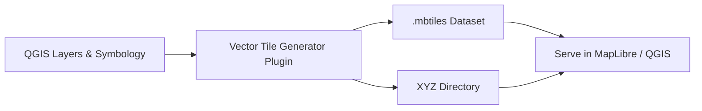

# QGIS Vector Tile Generator Plugin

### 🧭 Overview
**QGIS Vector Tile Generator** is a QGIS plugin that automatically exports your **entire QGIS project** — including **all symbology, labeling, and data formats** — into a **single vector tile dataset** (`.mbtiles` or XYZ directory).

Unlike raster tile caches, this plugin produces **lightweight, dynamic, and fully cartographic vector tiles**, ready to be served as **fast map layers** in QGIS, web maps, or MapLibre.

---

### ⚙️ Key Features
- 🧩 **Full Symbology Support**
  - Single, categorized, graduated, rule-based & nested rules  
  - Geometry generators  
  - Labeling placement, priorities & rules

- 🗂️ **Supports All QGIS Layer Formats**
  - Shapefile, GeoPackage, FlatGeobuf, Parquet, PostgreSQL/PostGIS, ESRI GDB, etc.

- ⚡ **High Performance**
  - Vector tiles generated directly from your QGIS project  
  - Faster than raster tiles, smaller storage footprint  
  - Can be served as a **fast WMS-like service**

- 🌍 **Output Formats**
  - `.mbtiles` (single file)
  - XYZ tiles directory structure

---

### 🧩 Workflow

```text
        ┌────────────────────┐
        │  QGIS Project (.qgz)│
        └────────┬───────────┘
                 │
                 ▼
        ┌────────────────────┐
        │ Symbology + Layers │
        │  (all data formats)│
        └────────┬───────────┘
                 │
                 ▼
        ┌────────────────────┐
        │  QGIS Vector Tile  │
        │    Generator       │
        └────────┬───────────┘
                 │
     ┌───────────┴─────────────┐
     ▼                         ▼
 .mbtiles file            XYZ directory
 (single dataset)        (tile pyramid)
```

---

### 🚀 Example Usage

1. Open your QGIS project with styled layers.  
2. Launch **Vector Tile Generator** from the QGIS Plugins menu.  
3. Choose:
   - **Output type:** `.mbtiles` or XYZ directory  
   - **Tile extent** and **zoom levels**
4. Click **Generate** ✅  
5. Output:
   - `myproject.mbtiles` or `xyz_tiles/{z}/{x}/{y}.pbf`

You can preview the generated vector tiles:
- In QGIS (`Layer → Add Vector Tile Layer → ...`)
- Or serve them on the web using **MapLibre GL**, **MapTiler**, or **Tileserver GL**

---

### 🌟 Advantages

| Feature | Description |
|----------|-------------|
| 🗺️ **Full Cartography** | Preserves QGIS symbology and labels (unlike MapLibre default styling) |
| ⚡ **Speed** | Vector tile creation and rendering are much faster than raster caching |
| 💾 **Lightweight** | Output size is smaller and scales better for large datasets |
| 🔗 **All Data Sources** | Works with mixed layer types (local files + databases) |
| 🔍 **WMS Alternative** | Can serve as a fast WMS/WMTS replacement with full styling |

---

### 🛠️ Installation

1. Copy the plugin folder into your QGIS plugins directory:
   ```
   C:\Users\<you>\AppData\Roaming\QGIS\QGIS3\profiles\default\python\plugins\
   ```
2. Restart QGIS and enable the plugin under:
   `Plugins → Manage and Install Plugins`

---

### 📈 Roadmap
- [ ] Add CLI mode for headless tile generation  
- [ ] Support symbol scaling per zoom  
- [ ] Integrate with Tileserver GL for direct serving  
- [ ] Optional compression optimization

---

### 📸 Visualization Example



---

### 🧑‍💻 Author
Developed by [Your Name or Org]  
Built with ❤️ using QGIS + GDAL + Python.
